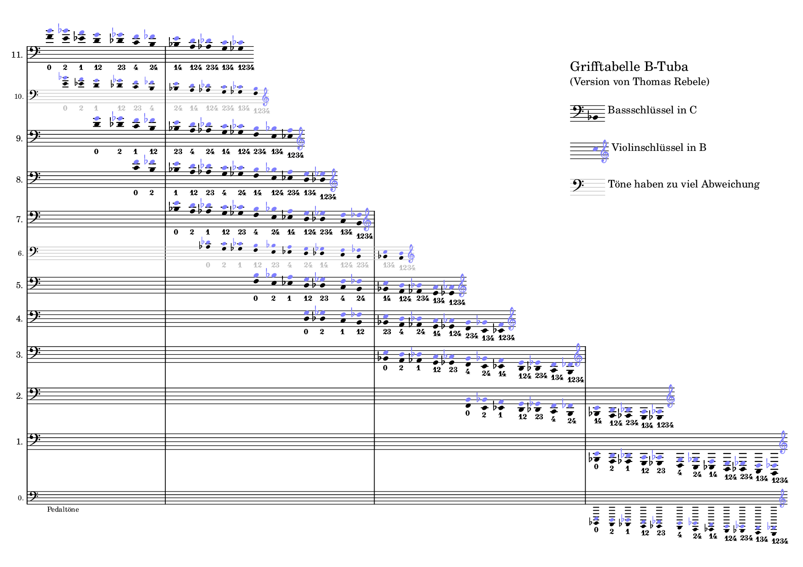

# Grifftabelle für B-Tuba

Eine Grifftabelle für eine 4-ventilige B-Tuba, die alle spielbaren Noten bis zum 11. Naturton zeigt. Mit Ausnahme der Pedaltöne sind gleiche Noten übereinander gedruckt.

Empfohlen zum Drucken: <a href="grifftabelle-hoch.pdf?raw=true">PDF Hochformat</a>

Für den Bildschirm: <a href="grifftabelle-quer.pdf?raw=true">PDF Querformat</a>

------

# Fingering chart for Bb tuba

A fingering chart for a 4-valve Bb tuba, showing all playable notes up to the 11th natural. Currently only available in German. Feel free to make a PR or let me know if you need a translation.

Recommended for printing: <a href="grifftabelle-hoch.pdf?raw=true">PDF portrait format</a>

For the screen: <a href="grifftabelle-quer.pdf?raw=true">PDF landscape format</a>
